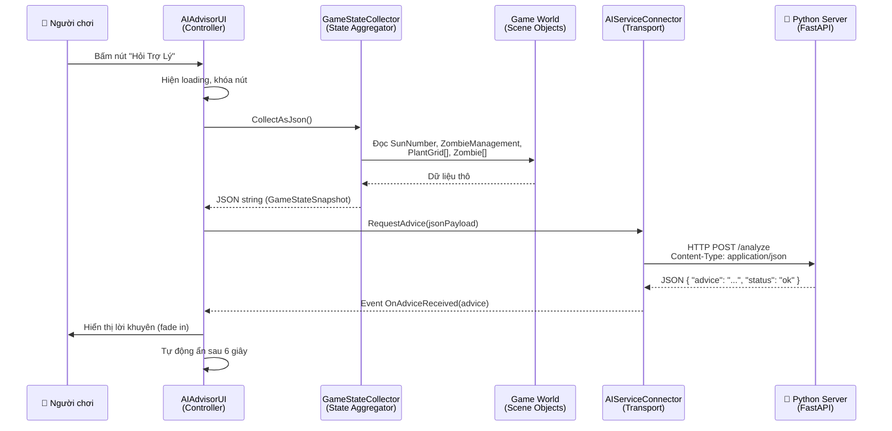

# Kiến Trúc Hệ Thống Trợ Lý AI — PvZ2 Fusion

> Tài liệu kỹ thuật chi tiết dành cho đội phát triển **Server AI (Python)** để triển khai backend tương thích chính xác với client Unity.

---

## 1. Tổng Quan Kiến Trúc



---

## 2. API Contract — Giao Thức Giao Tiếp

### 2.1. Endpoint

| Thuộc tính | Giá trị |
|:---|:---|
| **URL** | `http://localhost:8000/analyze` |
| **Method** | `POST` |
| **Content-Type** | `application/json; charset=utf-8` |
| **Timeout** | `15 giây` (cấu hình được trong Unity Inspector) |

---

### 2.2. REQUEST — Dữ Liệu Client Gửi Lên

Client Unity gửi lên một JSON object duy nhất là `GameStateSnapshot`, chứa toàn bộ trạng thái trận đấu tại thời điểm người chơi bấm nút.

#### Schema Tổng Quan

```json
{
  "level": int,
  "levelName": string,
  "isDay": bool,
  "currentSun": int,
  "currentWave": int,
  "totalWaves": int,
  "zombiesOnField": int,
  "nextWaveZombieType": string,
  "availablePlantCards": [string, ...],
  "plants": [PlantInfo, ...],
  "zombies": [ZombieInfo, ...],
  "emptyGrids": [GridInfo, ...]
}
```

#### Chi Tiết Từng Trường

##### Thông tin màn chơi (Level metadata)

| Trường | Kiểu | Mô tả | Ví dụ |
|:---|:---|:---|:---|
| `level` | `int` | Số thứ tự màn chơi (0-indexed) | `0`, `1`, `5` |
| `levelName` | `string` | Tên hiển thị của màn chơi | `"Màn 1 - Sân trước"` |
| `isDay` | `bool` | `true` = ban ngày (có mặt trời rơi tự nhiên), `false` = ban đêm (chỉ dựa vào SunFlower) | `true` |

##### Tài nguyên hiện tại

| Trường | Kiểu | Mô tả | Ví dụ |
|:---|:---|:---|:---|
| `currentSun` | `int` | Số mặt trời người chơi đang có. Giá trị bội số của 25 (25, 50, 75...) | `150` |
| `availablePlantCards` | `string[]` | Danh sách tên các thẻ cây mà người chơi được phép sử dụng trong màn này | `["SunFlower", "PeaShooter", "WallNut", "Squash"]` |

##### Thông tin đợt tấn công (Wave info)

| Trường | Kiểu | Mô tả | Ví dụ |
|:---|:---|:---|:---|
| `currentWave` | `int` | Chỉ số đợt zombie hiện tại (0-indexed). Đợt 0 là đợt đầu tiên | `3` |
| `totalWaves` | `int` | Tổng số đợt zombie trong toàn bộ màn chơi | `14` |
| `zombiesOnField` | `int` | Số lượng zombie **đang còn sống** trên sân tại thời điểm snapshot | `5` |
| `nextWaveZombieType` | `string` | Tên loại zombie của đợt kế tiếp. Nếu hết đợt → `"Hết đợt"` | `"ConeZombie"` hoặc `"Hết đợt"` |

---

##### `PlantInfo` — Thông tin từng cây đang trồng

```json
{
  "type": string,
  "row": int,
  "col": int,
  "posX": float,
  "posY": float,
  "hp": int,
  "maxHp": int,
  "state": string,
  "intensified": bool
}
```

| Trường | Kiểu | Mô tả | Giá trị có thể |
|:---|:---|:---|:---|
| `type` | `string` | Tên loại cây (tên Prefab, đã loại bỏ "(Clone)") | `"SunFlower"`, `"PeaShooter"`, `"WallNut"`, `"Squash"`, `"SnowKing"`, `"TorchWood"`, `"MiaoMiao"`, `"FireWallNutFusion"` |
| `row` | `int` | Hàng cây đang đứng (0-indexed, từ trên xuống dưới) | `0` → `4` |
| `col` | `int` | Cột cây đang đứng (0-indexed, từ trái sang phải) | `0` → `8` |
| `posX` | `float` | Tọa độ X trong world space | `-2.45` |
| `posY` | `float` | Tọa độ Y trong world space | `1.2` |
| `hp` | `int` | Máu hiện tại | `200` |
| `maxHp` | `int` | Máu tối đa (giá trị ban đầu khi được trồng) | `300` |
| `state` | `string` | Trạng thái hiện tại của cây | `"Normal"`, `"Warm"`, `"Cold"` |
| `intensified` | `bool` | `true` nếu cây đang được SnowKing buff tăng cường | `true` / `false` |

> [!NOTE]
> **Ý nghĩa state của Plant:**
> - `"Normal"`: Trạng thái bình thường
> - `"Warm"`: Đang được sưởi ấm bởi TorchWood (miễn nhiễm Cold)
> - `"Cold"`: Bị đóng băng bởi SnowZombie, tốc độ giảm 50%, chịu 8 damage/giây

---

##### `ZombieInfo` — Thông tin từng zombie đang sống

```json
{
  "type": string,
  "row": int,
  "posX": float,
  "hp": int,
  "maxHp": int,
  "state": string
}
```

| Trường | Kiểu | Mô tả | Giá trị có thể |
|:---|:---|:---|:---|
| `type` | `string` | Tên loại zombie (tên Prefab, đã loại bỏ "(Clone)") | Xem bảng loại zombie bên dưới |
| `row` | `int` | Hàng zombie đang di chuyển (0-indexed) | `0` → `4` |
| `posX` | `float` | Tọa độ X hiện tại. **Càng nhỏ = càng gần nhà** (game over line). Zombie sinh ra ở `posX ≈ 6.0`, nhà ở khoảng `posX ≈ -4.5` | `3.2` |
| `hp` | `int` | Máu hiện tại | `100` |
| `maxHp` | `int` | Máu tối đa ban đầu | `270` |
| `state` | `string` | Trạng thái hiện tại | `"Normal"`, `"Cold"`, `"Parasiticed"` |

> [!NOTE]
> **Ý nghĩa state của Zombie:**
> - `"Normal"`: Di chuyển và tấn công bình thường
> - `"Cold"`: Bị làm chậm (do cây băng hoặc SnowKing)
> - `"Parasiticed"`: Bị ký sinh bởi MiaoMiao, mất 1% HP/giây và chữa lành cho cây ký sinh

---

##### `GridInfo` — Thông tin ô đất trống

```json
{
  "row": int,
  "col": int,
  "posX": float,
  "posY": float
}
```

| Trường | Kiểu | Mô tả |
|:---|:---|:---|
| `row` | `int` | Hàng của ô trống (0-indexed) |
| `col` | `int` | Cột của ô trống (0-indexed) |
| `posX` | `float` | Tọa độ X world space |
| `posY` | `float` | Tọa độ Y world space |

> [!TIP]
> Dùng `emptyGrids` để AI biết **chỗ nào có thể trồng cây mới**. Kết hợp với `currentSun` để quyết định nên trồng gì, ở đâu.

---

### 2.3. RESPONSE — Dữ Liệu Server Trả Về

Server Python **BẮT BUỘC** trả về JSON với cấu trúc sau:

```json
{
  "advice": "Lời khuyên chiến thuật bằng tiếng Việt",
  "status": "ok"
}
```

| Trường | Kiểu | Bắt buộc | Mô tả |
|:---|:---|:---|:---|
| `advice` | `string` | ✅ **Bắt buộc** | Lời khuyên chiến thuật bằng **tiếng Việt**, tối đa ~200 ký tự để hiển thị vừa khung UI |
| `status` | `string` | ❌ Tùy chọn | `"ok"` khi thành công, `"error"` khi có lỗi (hiện chưa dùng ở client nhưng nên có) |

> [!IMPORTANT]
> **Trường `advice` là trường DUY NHẤT mà client Unity đọc và hiển thị lên màn hình.**
> Client dùng `JsonUtility.FromJson<AIResponse>(responseJson)` để parse, trong đó class `AIResponse` chỉ có 2 trường: `advice` (string) và `status` (string).

#### Ví dụ Response Thành Công

```json
{
  "advice": "Hàng 2 đang trống, có BucketZombie đang tiến vào! Hãy trồng WallNut ở hàng 2 cột 1 để cản, rồi đặt PeaShooter phía sau.",
  "status": "ok"
}
```

#### Ví dụ Response Khi Lỗi

```json
{
  "advice": "Không thể phân tích trạng thái game. Vui lòng thử lại.",
  "status": "error"
}
```

> [!WARNING]
> **Nếu server trả HTTP status code ≠ 200**, hoặc response JSON không parse được, client sẽ hiển thị thông báo lỗi kết nối tự động. KHÔNG cần server xử lý trường hợp này.

---

## 3. Ví Dụ JSON Request Thực Tế

Đây là một JSON mẫu mà Unity sẽ gửi lên khi người chơi đang ở giữa trận:

```json
{
  "level": 0,
  "levelName": "Vườn Băng Tuyết",
  "isDay": false,
  "currentSun": 150,
  "currentWave": 5,
  "totalWaves": 14,
  "zombiesOnField": 4,
  "nextWaveZombieType": "SnowZombie",
  "availablePlantCards": [
    "SunFlower",
    "PeaShooter",
    "WallNut",
    "Squash",
    "SnowKing",
    "TorchWood"
  ],
  "plants": [
    {
      "type": "SunFlower",
      "row": 0,
      "col": 0,
      "posX": -3.8,
      "posY": 2.0,
      "hp": 300,
      "maxHp": 300,
      "state": "Normal",
      "intensified": false
    },
    {
      "type": "PeaShooter",
      "row": 0,
      "col": 2,
      "posX": -2.1,
      "posY": 2.0,
      "hp": 300,
      "maxHp": 300,
      "state": "Cold",
      "intensified": false
    },
    {
      "type": "WallNut",
      "row": 1,
      "col": 4,
      "posX": -0.4,
      "posY": 1.0,
      "hp": 120,
      "maxHp": 4000,
      "state": "Normal",
      "intensified": true
    }
  ],
  "zombies": [
    {
      "type": "ZombieNormal",
      "row": 0,
      "posX": 3.5,
      "hp": 270,
      "maxHp": 270,
      "state": "Normal"
    },
    {
      "type": "ConeZombie",
      "row": 1,
      "posX": 1.2,
      "hp": 350,
      "maxHp": 560,
      "state": "Cold"
    },
    {
      "type": "BucketZombie",
      "row": 3,
      "posX": 2.8,
      "hp": 1100,
      "maxHp": 1370,
      "state": "Normal"
    },
    {
      "type": "SnowZombie",
      "row": 2,
      "posX": 4.1,
      "hp": 270,
      "maxHp": 270,
      "state": "Normal"
    }
  ],
  "emptyGrids": [
    { "row": 0, "col": 1, "posX": -2.95, "posY": 2.0 },
    { "row": 1, "col": 0, "posX": -3.8, "posY": 1.0 },
    { "row": 1, "col": 1, "posX": -2.95, "posY": 1.0 },
    { "row": 2, "col": 0, "posX": -3.8, "posY": 0.0 },
    { "row": 2, "col": 1, "posX": -2.95, "posY": 0.0 },
    { "row": 3, "col": 0, "posX": -3.8, "posY": -1.0 },
    { "row": 3, "col": 1, "posX": -2.95, "posY": -1.0 },
    { "row": 4, "col": 0, "posX": -3.8, "posY": -2.0 },
    { "row": 4, "col": 1, "posX": -2.95, "posY": -2.0 }
  ]
}
```

---

## 4. Danh Sách Các Loại Zombie Trong Game

| Tên type (string) | Mô tả | Máu tham khảo | Đặc điểm |
|:---|:---|:---|:---|
| `ZombieNormal` | Zombie thường | 270 | Không có gì đặc biệt |
| `ConeZombie` | Zombie đội nón giao thông | 560 | Máu cao hơn thường |
| `BucketZombie` | Zombie đội xô sắt | 1370 | Máu rất cao, cần nhiều firepower |
| `SnowZombie` | Zombie băng | 270 | Khi tấn công cây → đóng băng cây (state=Cold) |
| `YetiZombie` | Zombie người tuyết | ~270 | Xuất hiện bất ngờ |
| `BoneZombie` | Zombie xương | Tùy cấu hình | Đặc biệt |
| `IceBlockZombie` | Zombie khối băng | Cao | Có khiên băng bảo vệ |
| `ChineseZombie` | Zombie Trung Hoa | Tùy cấu hình | Di chuyển theo đội hình liên kết |
| `Ghost` | Bóng Ma | Tùy cấu hình | Xuất hiện ngẫu nhiên, đặc biệt |

---

## 5. Danh Sách Các Loại Cây Trong Game

| Tên type (string) | Chi phí mặt trời | Máu tham khảo | Chức năng |
|:---|:---|:---|:---|
| `SunFlower` | 50 | 300 | Tạo mặt trời (tài nguyên) |
| `PeaShooter` | 100 | 300 | Bắn đạn đậu theo hàng |
| `WallNut` | 50 | 4000 | Cây phòng thủ chịu sát thương cao |
| `Squash` | 50 | 300 | Nhảy lên đầu zombie gây sát thương lớn, chết sau 1 lần dùng |
| `SnowKing` | 175 | Cao | Buff tăng cường (intensified=true) tất cả cây khi hát |
| `TorchWood` | 175 | 300 | Sưởi ấm cây xung quanh (state=Warm), biến đạn đậu thành đạn lửa |
| `MiaoMiao` | 50 | 300 | Ký sinh lên zombie, hút máu zombie để tự hồi |
| `FireWallNutFusion` | - | Cao | Cây lai ghép (WallNut + TorchWood), vừa chịu đòn vừa gây sát thương phản |

---

## 6. Kiến Thức Chiến Thuật Cho AI

> [!IMPORTANT]
> Đây là các quy tắc logic mà AI server cần biết để đưa ra lời khuyên hợp lý:

### 6.1. Hệ tọa độ sân cỏ

```
← posX nhỏ (nhà)                     posX lớn (zombie spawn) →

   Col 0    Col 1    Col 2    Col 3    Col 4    ...    Col 8
  ┌────────┬────────┬────────┬────────┬────────┬───────┬────────┐
  │ Row 0  │        │        │        │        │       │        │  ← Hàng trên cùng
  ├────────┼────────┼────────┼────────┼────────┼───────┼────────┤
  │ Row 1  │        │        │        │        │       │        │
  ├────────┼────────┼────────┼────────┼────────┼───────┼────────┤
  │ Row 2  │        │        │        │        │       │        │
  ├────────┼────────┼────────┼────────┼────────┼───────┼────────┤
  │ Row 3  │        │        │        │        │       │        │
  ├────────┼────────┼────────┼────────┼────────┼───────┼────────┤
  │ Row 4  │        │        │        │        │       │        │  ← Hàng dưới cùng
  └────────┴────────┴────────┴────────┴────────┴───────┴────────┘
    posX≈-3.8                                          posX≈6.0
    (Nhà)                                          (Zombie spawn)
```

- **Zombie đi từ phải sang trái** (posX giảm dần).
- **Cây được trồng từ trái sang phải** (col 0 gần nhà nhất).
- Zombie `posX < 0` → đã vào khu vực nguy hiểm gần nhà.
- Zombie `posX < -3` → sắp thua (game over).

### 6.2. Các tình huống AI nên phát hiện và khuyên

| Tình huống | Dấu hiệu nhận biết | Lời khuyên hợp lý |
|:---|:---|:---|
| **Thiếu mặt trời** | `currentSun < 100` và ít `SunFlower` trong `plants` | Trồng thêm SunFlower |
| **Hàng trống nguy hiểm** | Có zombie ở `row` X nhưng không có plant nào ở `row` X | Trồng WallNut hoặc PeaShooter ở hàng đó |
| **Zombie mạnh đang đến** | Zombie type là `BucketZombie` hoặc `IceBlockZombie` | Cần nhiều PeaShooter hoặc Squash |
| **Cây sắp chết** | Plant có `hp / maxHp < 0.2` (dưới 20% máu) | Chuẩn bị trồng thay thế |
| **Zombie sắp tới nhà** | Zombie `posX < -1.0` | Cảnh báo khẩn cấp |
| **Đợt cuối** | `nextWaveZombieType == "Hết đợt"` | Tập trung bảo vệ, không cần trồng thêm |
| **Cây bị đóng băng** | Plant `state == "Cold"` | Trồng TorchWood gần đó để sưởi ấm |
| **Ban đêm** | `isDay == false` | Bắt buộc trồng SunFlower nhiều vì không có mặt trời rơi |

### 6.3. Giới hạn hiển thị

- Lời khuyên nên **ngắn gọn, dưới 200 ký tự** tiếng Việt.
- Viết **bằng tiếng Việt** vì game hướng tới người chơi Việt Nam.
- Một câu khuyên duy nhất, tập trung vào hành động cụ thể nhất.

---

## 7. Gợi Ý Triển Khai Server Python (FastAPI)

```python
from fastapi import FastAPI
from pydantic import BaseModel
from typing import List, Optional

app = FastAPI()

# ---- Request Models ----
class PlantInfo(BaseModel):
    type: str
    row: int
    col: int
    posX: float
    posY: float
    hp: int
    maxHp: int
    state: str          # "Normal" | "Warm" | "Cold"
    intensified: bool

class ZombieInfo(BaseModel):
    type: str
    row: int
    posX: float
    hp: int
    maxHp: int
    state: str          # "Normal" | "Cold" | "Parasiticed"

class GridInfo(BaseModel):
    row: int
    col: int
    posX: float
    posY: float

class GameStateSnapshot(BaseModel):
    level: int
    levelName: str
    isDay: bool
    currentSun: int
    currentWave: int
    totalWaves: int
    zombiesOnField: int
    nextWaveZombieType: str
    availablePlantCards: List[str]
    plants: List[PlantInfo]
    zombies: List[ZombieInfo]
    emptyGrids: List[GridInfo]

# ---- Response Model ----
class AIResponse(BaseModel):
    advice: str
    status: str = "ok"

# ---- Endpoint ----
@app.post("/analyze", response_model=AIResponse)
async def analyze_game_state(state: GameStateSnapshot):
    """
    Nhận trạng thái game từ Unity client,
    phân tích và trả về lời khuyên chiến thuật.
    """
    # TODO: Triển khai logic phân tích AI ở đây
    # Có thể gọi LLM (Gemini, GPT, ...) hoặc dùng rule-based
    advice = generate_advice(state)
    return AIResponse(advice=advice, status="ok")

def generate_advice(state: GameStateSnapshot) -> str:
    """Placeholder - Thay thế bằng logic AI thực tế."""
    return "Đây là lời khuyên mẫu từ server."
```

### Chạy server:

```bash
pip install fastapi uvicorn
uvicorn main:app --host 0.0.0.0 --port 8000 --reload
```

---

## 8. Chuyển Từ Mock Mode Sang Server Thật

Khi server Python đã sẵn sàng, trong Unity Inspector trên GameObject **AI Advisor**:

1. Tìm component **AI Service Connector**.
2. **Bỏ tích** ô `Use Mock Mode` (đặt thành `false`).
3. Kiểm tra ô `Server Url` đang là `http://localhost:8000/analyze` (hoặc đổi sang địa chỉ server thực).
4. Bấm **Play** và test.

> [!CAUTION]
> **Không cần sửa bất kỳ dòng code C# nào.** Chỉ cần thay đổi 1 checkbox trong Inspector là client tự động chuyển sang gọi server thật.

---

## 9. Sơ Đồ File Liên Quan

```
Assets/Resources/Scripts/AI/
├── GameStateSnapshot.cs   ← Định nghĩa data model (DTO / schema)
├── GameStateCollector.cs  ← Thu thập dữ liệu từ game world → JSON
├── AIServiceConnector.cs  ← Gửi HTTP POST / Mock engine
└── AIAdvisorUI.cs         ← Controller UI (nút bấm, hiển thị, fade)

Assets/Resources/Scripts/ (các file game đã sửa nhỏ)
├── Zombies/Zombie.cs      ← Thêm property BloodVolumeMax
├── Plants/Plant.cs        ← Thêm property BloodVolumeMax, Intensified
├── Sun/SunNumber.cs       ← Thêm property NowSun
└── Zombies/ZombieManagement.cs ← Thêm property ZombieNum_now, NowNode_index, etc.
```
